# Knowledge Graph Visualization

This document provides visual representations of the knowledge graph stored in `memory.jsonl`.

## Overview

The knowledge graph tracks:
- **Entities**: Repository, SDKs, Languages, Agents, Tools, Patterns, MCPServers, Documentation, Architectural Decisions, Learnings, Skills
- **Relations**: uses, implements, includes, demonstrates, exemplifies, supports, tests, implemented_in, integrates, informs

## Interactive Visualization

We provide **two visualization options**, each with different strengths:

### Option 1: vis.js Network (Recommended for Graph Exploration)

**Best for:** Interactive exploration, physics simulation, node manipulation

```bash
cd docs/memory

# Install dependencies (using uv recommended):
uv pip install -r requirements.txt

# Then run (using uv run to use the venv):
uv run python visualize_knowledge_graph_visjs.py
```

**Features:**
- ✅ **Physics simulation** - Natural, dynamic layout that stabilizes automatically
- ✅ **Drag nodes** - Manually rearrange nodes for better understanding
- ✅ **Search & filter** - Real-time search box to find specific entities
- ✅ **Better graph algorithms** - Optimized for network/graph visualization
- ✅ **Export as PNG** - One-click image export
- ✅ **Node highlighting** - Click nodes to see their connections
- ✅ **Smooth animations** - Better visual feedback

**Output:** `knowledge_graph_visjs.html`

### Option 2: Plotly (Alternative)

**Best for:** Static analysis, publication-quality charts, statistical overlays

```bash
cd docs/memory

# Install dependencies (using uv recommended):
uv pip install -r requirements.txt

# Then run (using uv run to use the venv):
uv run python visualize_knowledge_graph.py
```

**Features:**
- ✅ **Statistical overlays** - Better for adding data analysis
- ✅ **Publication quality** - High-resolution export options
- ✅ **Legend-based filtering** - Toggle entity/relation types via legend
- ✅ **Hover tooltips** - Rich information on hover

**Output:** `knowledge_graph.html`

### Comparison

| Feature | vis.js Network | Plotly |
|---------|---------------|--------|
| **Graph-specific** | ✅ Optimized for networks | ⚠️ General-purpose |
| **Physics simulation** | ✅ Yes | ❌ No |
| **Drag nodes** | ✅ Yes | ❌ No |
| **Search nodes** | ✅ Yes | ❌ No |
| **Performance** | ✅ Better for graphs | ⚠️ Good but heavier |
| **Export quality** | ✅ PNG export | ✅ Multiple formats |
| **Learning curve** | ✅ Easy | ⚠️ Moderate |

**Recommendation:** Use **vis.js Network** for exploring and understanding the knowledge graph structure. Use **Plotly** if you need statistical analysis or publication-quality charts.

## Mermaid Diagram

Below is a simplified Mermaid diagram showing key relationships:

```mermaid
graph TB
    %% Repository
    Repo[claude-code-agent<br/>Repository]
    
    %% SDKs
    ClaudeSDK[Claude SDK]
    StrandsSDK[Strands Agents]
    
    %% Languages
    TS[TypeScript]
    Python[Python]
    
    %% Agents
    FinAgent[financial-advisor-agent]
    DriveAgent[google-drive-agent]
    FIAAgent[fia-analyzer-agent]
    
    %% Patterns
    ZodPattern[Zod Validation Pattern]
    SubagentPattern[Subagent Specialization Pattern]
    WorkflowPattern[Workflow Stage Pattern]
    MockDataPattern[Mock Data Integration Pattern]
    DirectContextPattern[Direct Context Passing Pattern]
    ServicePattern[Service-Based Architecture Pattern]
    ExternalServicePattern[External Service Integration Pattern]
    SimplifiedArchPattern[Simplified Architecture Pattern]
    
    %% Learnings
    ToolDesignBP[Tool Design Best Practices]
    ComplexityMgmt[Agent Complexity Management]
    ExternalServicesReduce[External Services Reduce Complexity]
    
    %% MCP Servers
    Context7[context7]
    MemoryServer[memory-server]
    AWSDocs[aws-documentation-mcp-server]
    BedrockMCP[bedrock-agentcore-mcp-server]
    StrandsMCP[strands-agents-mcp]
    
    %% Repository connections
    Repo -->|tests| ClaudeSDK
    Repo -->|tests| StrandsSDK
    Repo -->|uses| Context7
    Repo -->|uses| MemoryServer
    Repo -->|uses| AWSDocs
    Repo -->|uses| BedrockMCP
    Repo -->|uses| StrandsMCP
    
    %% SDK to Language
    ClaudeSDK -->|supports| TS
    ClaudeSDK -->|supports| Python
    StrandsSDK -->|supports| TS
    StrandsSDK -->|supports| Python
    
    %% Agents to SDKs and Languages
    FinAgent -->|uses| ClaudeSDK
    FinAgent -->|implemented_in| TS
    DriveAgent -->|uses| StrandsSDK
    DriveAgent -->|implemented_in| Python
    FIAAgent -->|uses| ClaudeSDK
    FIAAgent -->|implemented_in| Python
    
    %% Agents to Patterns
    FinAgent -->|implements| ZodPattern
    FinAgent -->|implements| SubagentPattern
    FinAgent -->|implements| WorkflowPattern
    FinAgent -->|implements| MockDataPattern
    DriveAgent -->|implements| DirectContextPattern
    DriveAgent -->|implements| ServicePattern
    FIAAgent -->|implements| ExternalServicePattern
    FIAAgent -->|implements| SimplifiedArchPattern
    
    %% Patterns to Learnings
    ZodPattern -->|exemplifies| ToolDesignBP
    SubagentPattern -->|exemplifies| ComplexityMgmt
    WorkflowPattern -->|exemplifies| ComplexityMgmt
    MockDataPattern -->|exemplifies| ComplexityMgmt
    DirectContextPattern -->|exemplifies| ComplexityMgmt
    ServicePattern -->|exemplifies| ComplexityMgmt
    ExternalServicePattern -->|exemplifies| ExternalServicesReduce
    SimplifiedArchPattern -->|exemplifies| ComplexityMgmt
    
    %% Styling
    classDef repository fill:#FF6B6B,stroke:#333,stroke-width:3px
    classDef sdk fill:#4ECDC4,stroke:#333,stroke-width:2px
    classDef language fill:#45B7D1,stroke:#333,stroke-width:2px
    classDef agent fill:#96CEB4,stroke:#333,stroke-width:2px
    classDef pattern fill:#DDA0DD,stroke:#333,stroke-width:2px
    classDef learning fill:#85C1E2,stroke:#333,stroke-width:2px
    classDef mcp fill:#98D8C8,stroke:#333,stroke-width:2px
    
    class Repo repository
    class ClaudeSDK,StrandsSDK sdk
    class TS,Python language
    class FinAgent,DriveAgent,FIAAgent agent
    class ZodPattern,SubagentPattern,WorkflowPattern,MockDataPattern,DirectContextPattern,ServicePattern,ExternalServicePattern,SimplifiedArchPattern pattern
    class ToolDesignBP,ComplexityMgmt,ExternalServicesReduce learning
    class Context7,MemoryServer,AWSDocs,BedrockMCP,StrandsMCP mcp
```



## Entity Type Legend

- 🔴 **Repository**: The main repository entity
- 🔵 **SDK**: Software development kits (Claude SDK, Strands Agents)
- 💙 **Language**: Programming languages (TypeScript, Python)
- 🟢 **Agent**: Production-ready AI agents
- 🟡 **Tool**: Individual tools used by agents
- 🟣 **Pattern**: Reusable design patterns
- 🟦 **Learning**: Key learnings and best practices
- 🟩 **MCP Server**: Model Context Protocol servers
- 🟧 **Architectural Decision**: High-level architectural choices
- 🟨 **Documentation**: Documentation resources
- 🍑 **Skill**: Claude Agent Skills

## Key Relationships

### Agent → SDK/Language
- Agents are built using specific SDKs and implemented in specific languages
- Example: `financial-advisor-agent` uses `Claude SDK` and is implemented in `TypeScript`

### Agent → Pattern
- Agents implement various design patterns
- Patterns capture reusable solutions to common problems

### Pattern → Learning
- Patterns exemplify broader learnings and best practices
- Learnings are derived from multiple pattern implementations

### Repository → MCP Server
- The repository uses various MCP servers for documentation, memory, and AWS services

## Usage

1. **View Interactive Graph**: Run `python visualize_knowledge_graph.py` to generate and open the interactive HTML visualization
2. **View Statistics**: Check `knowledge_graph_stats.md` for detailed metrics
3. **View Mermaid Diagram**: The diagram above renders in any Markdown viewer that supports Mermaid (GitHub, GitLab, VS Code with Mermaid extension)

## References

- [Memory System Documentation](../../CLAUDE.md#memory-system-docsmemorymemoryjsonl)
- [MCP Memory Server](https://modelcontextprotocol.io)
- [NetworkX Documentation](https://networkx.org/)
- [Plotly Documentation](https://plotly.com/python/)

